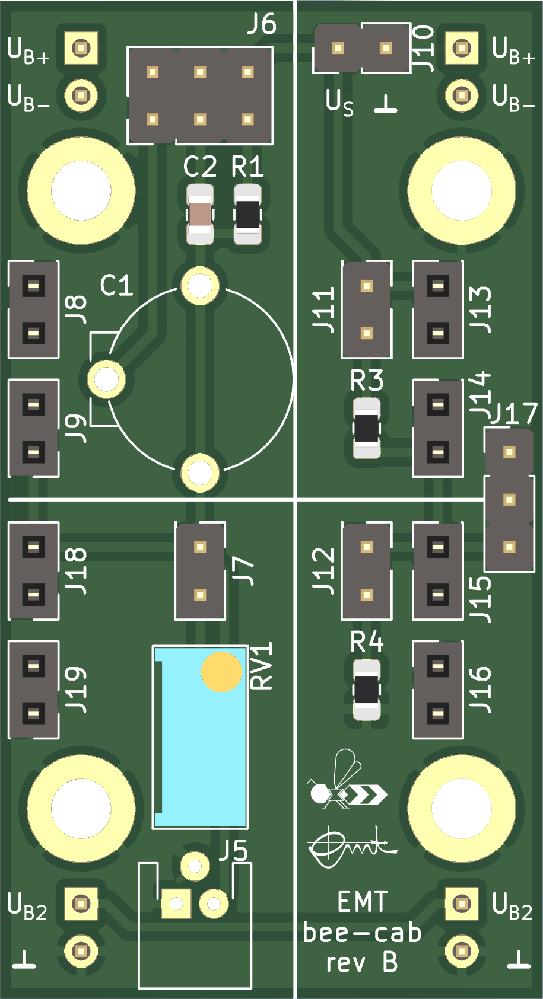

bee-cab
=======

This [bee](https://github.com/beecourse) provides a **ca**pacitive measuring **b**ridge.
It is intended for use with the capacitive force sensor [S15-45N from SingleTact](https://www.singletact.com/micro-force-sensor/standard-sensors/15mm-standard-sensor/15mm-45newton/), which can be connected to J5.

